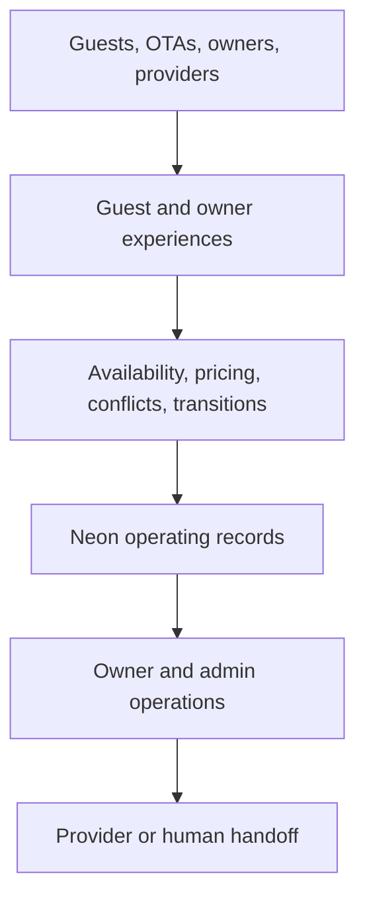

# CJT Platform Maps

Status: **Living architecture and delivery ledger**

Portal route: `/admin-v1/maps`

Current version: **2.0 — audited 2026-09-07**

Audit baseline: `reorg/platform-v1` at `ccc45667eb5f5727f5a3f8c8be22a0c9a7b793a1` (merged PR #95)
Map rebuild issue: [#96](https://github.com/DalboGuy/cjt-real-estate/issues/96)

Live Git and deployed behavior remain authoritative. Re-audit this document after any later merge to `reorg/platform-v1`; do not assume the baseline SHA is still the branch tip.

## Purpose

Platform Maps is the visual operating blueprint for the CJT short-term-rental platform. It answers four questions at progressively deeper levels:

1. **Platform:** how the complete product connects.
2. **Domain:** which business capability owns a concern.
3. **Workflow:** what happens from a trigger to an outcome.
4. **Data lineage:** which UI, route, rule, table, provider, response, and failure state participate.

The map is also the current omission ledger. A capability must not disappear merely because it is not yet built.

## Product rules that apply everywhere

These rules are owner-approved or safety-critical. Do not change them through a maps or presentation PR.

- A submitted booking request locks the requested nights until an owner **explicitly releases** them. There is no automatic 24-hour expiration.
- Availability fails closed. If a required calendar source is unhealthy, inventory is **unknown**, not open.
- Availability lock, owner approval, contract, payment, and confirmation are separate business facts.
- Stripe remains **parked**. Do not test or activate payments without explicit owner approval.
- Owner Portal authentication is required by default. Draft PRs #50 and #51 must not merge as written.
- Preview must use the official Preview Neon branch and must fail closed before using the known Production host.
- Financial reporting uses supported stored values only. It does not invent fees, payouts, NOI, profit, or occupancy.
- Maximum overnight occupancy is 14. Preview and Production schema constraints support 1–14; end-to-end Preview acceptance remains open.
- No real guest messaging is sent during acceptance unless explicitly approved.

## Platform overview

The common CJT pattern is:

`Source → guarded intake → normalize and validate → store or index → operating surface → CJT action or provider handoff`

## Status model

Every domain has separate status dimensions. Do not collapse them into one `Ready` label.

| Dimension | Question | Examples |
| --- | --- | --- |
| Build | Is implementation present? | Built, Partial, Planned |
| Environment | Where does it exist? | Code, Preview, Production |
| Verification | What evidence exists? | Unit, route, browser, data, end-to-end |
| Acceptance | Has Joel approved the real experience? | Accepted, Needs review |
| Delivery | Is work moving? | Active, Parked, Blocked, Deferred |

Vercel `Ready` proves that an artifact built. It does not prove the user story, database boundary, mobile experience, or product acceptance.

## Source-of-truth matrix

| Business fact | Authoritative source | CJT responsibility | Final action |
| --- | --- | --- | --- |
| Direct booking lifecycle | `reservations` + `booking_events` | System of record and event history | CJT Owner Portal / APIs |
| OTA reservation/availability | Official channel calendar plus CJT normalized view | Merge, de-duplicate, protect, and surface | Official channel for channel-owned edits |
| Direct/manual availability | Active CJT reservations + `owner_calendar_entries` | System of record | CJT Owner Calendar / Booking APIs |
| Direct pricing | `pricing_settings` + `pricing_seasons` | Validate, publish, quote, snapshot | CJT Owner Pricing |
| Existing direct quote | Latest stored quote event for the reservation | Preserve an auditable snapshot | CJT Owner Booking |
| Direct payment | Verified provider event when payments resume | Store provider verification; never trust client amount | Stripe + CJT event record |
| OTA financial values | `booking_financials` imported/entered values | Report supported facts and provenance | OTA for settlement |
| OTA conversation | Official OTA thread / source email | Index and add operating context | Official OTA thread for now |
| Direct website chat | tawk.to | Surface/link context | tawk.to |
| Documents | Chosen cloud provider | Future metadata index and relationships | Cloud file with CJT context |
| Identity/session | CJT identity tables | System of record and access enforcement | Account/Admin |
| Source code and artifact | Git + immutable Vercel deployment | Review, deploy, and verify | Controlled branch promotion |

## Domain status ledger

| # | Domain | Build | Verification / acceptance | Delivery | Primary surface | Primary API / library | Principal records | Next gate |
| --- | --- | --- | --- | --- | --- | --- | --- | --- |
| 01 | Guest Request-to-Book | Built foundation | Guest UI, persistence, owner read, and owner-card presentation are present; desktop/mobile/data E2E open | Active | `/booking-v2.html` | `/api/calendar`, `/api/quote`, `/api/inquiries`; `lib/inquiry-create.js` | `reservations`, `booking_events` | 2-guest and 14-guest Preview journey; prove trip/pet/event guest → owner |
| 02 | Availability & Owner Calendar | Built core; UX needs reorganization | Code coverage present; source/mobile/owner acceptance open | Active | `/owner-v1/calendar` + guest date picker | `/api/calendar`, `/api/owner`; `lib/availability.js`, `lib/calendar-view.js` | `calendar_connections`, `owner_calendar_entries`, `owner_calendar_settings`, `reservations` | Reorganize dashboard; verify source health and all views |
| 03 | Owner Booking Lifecycle | Partial | Transition tests and trip/pet/event owner presentation are present; full booking-cycle acceptance open | Active | `/owner-v1/reservations` | `/api/owner`; `lib/booking-transitions.js` | `reservations`, `booking_events` | Guest → owner acceptance; then decide contract/payment/confirmation order |
| 04 | Pricing & Quote | Partial | Save and quote code present; complete widget/save acceptance open | Active | `/owner-v1/pricing` | `/api/pricing`, `/api/quote`; `lib/pricing-store.js`, `lib/pricing.js` | `pricing_settings`, `pricing_seasons`, quote events | Verify saves/errors; define file-import and profitability model |
| 05 | Financials | Built dashboard; partial source coverage | Unit tests present; authenticated Preview smoke open | Needs review | `/owner-v1/financials` | `/api/financials`; `lib/financials.js` | `booking_financials`, direct quote/payment events | Stable booking links; add approved cost/channel model later |
| 06 | Communications | Partial | Existing hub operations; automatic intake not verified/built | Deferred | `/owner-v1/communications` | `/api/communications` | `communications_messages` | Choose and verify ingestion before claiming unified inbox |
| 07 | Contracts & Payments | OpenSign partial; Stripe parked | OpenSign/payment unit tests exist; provider E2E and product sequence open | Parked/decision | Owner Booking + confirmation page | `/api/opensign`, `/api/payments`; `lib/opensign.js`, `lib/payments.js` | `reservations`, `booking_events` | Decide sequence; link signed file; separately resume payments |
| 08 | Documents & Tasks | Documents planned; Tasks partial | Deployment-dependent tasks destination needs Preview evidence | Deferred | `/owner-v1/documents`, `/owner-v1/tasks` | `/api/owner-tasks`; `lib/owner-tasks.js` | Future document index; deployment `tasks` table | Choose cloud model and durable task schema |
| 09 | Identity & Permissions | Auth/sessions built; recovery partial; permissions planned | Code paths present; recovery delivery and scoped authorization open | Deferred expansion | `/login-v1`, `/account-v1`, `/admin-v1/users` | `/api/auth`, `/api/sessions`, `/api/password-recovery` | `owner_users`, `owner_sessions`, reset tokens, audit | Configure recovery; later roles/invitations/property enforcement |
| 10 | Navigation & Shared Context | Built shell; deep links partial | Page-level and mobile acceptance remains open | Active quality | Owner/Admin shells | `assets/js/owner-shell.js`, `lib/owner-context.js`, `lib/owner-nav.js` | URL context + destination API | Consistent KPI→module→record navigation |
| 11 | Deployment & Data Safety | Preview guard built; cutover partial | Reverify each acceptance deployment | Active guard | Vercel Preview / Neon Preview | `lib/db.js`; environment configuration | Git branch, Vercel artifact, Neon branch | Environment evidence, observability, explicit Production cutover |
| 12 | Guest Listing Content | Partial | Desktop/mobile/anonymous visual acceptance open | Needs review | `/booking-v2.html` | `assets/js/booking-listing.js` | Owner-approved repo content and public assets | Complete content acceptance; decide PR #90 |

## Detailed workflow maps

### 01 — Guest Request-to-Book

`Guest listing → calendar + quote reads → inquiry POST → locked transaction → reservation + event → owner review`

- Inputs: guest identity/contact, check-in, checkout, 1–14 guests, optional trip type, pet details, and event details.
- Transformations: normalize and validate inputs; fetch current price catalog; fail-closed OTA check; overlap checks; duplicate-safe replay.
- Writes: one `reservations` row plus an `inquiry_created` event containing the exact quote/options snapshot.
- Result: HTTP 201 for a new request; HTTP 200 with `replayed: true` for a safe retry; `reservation.id` is returned.
- Lock behavior: `inquiry_hold` and `hold_expires_at = NULL`; `expireHolds()` remains a compatibility no-op.
- Failure: 503 when availability cannot be verified; 409 when nights overlap; transaction avoids partial reservation/event state.
- Downstream: owner reservations, calendar inventory, financial quote reporting, later contract/payment facts.

### 02 — Availability & Owner Calendar

`Protected iCal sources → fetch/parse/classify → sourceHealth → merge direct/manual locks → guest + owner views`

- Required environment feeds and owner-added calendar connections remain protected server-side.
- `/api/calendar` returns `blockedDates`, public-safe `sources`, and `sourceHealth`.
- A required feed failure returns 503. An empty `blockedDates` list is not open inventory unless `sourceHealth.ok === true`.
- Owner calendar views support Month, Week, Year, and Day through `calendar_view` / `calendar_sync`.
- Owner manual blocks and owner stays use a shared date lock and cannot overlap active requests.
- Checkout is exclusive: it is the morning the property becomes available again.
- Prep/turnover is an operations layer and does not count as guest occupancy.
- Current iCal is not a two-way channel manager. Outbound rate/inventory control and proactive health alerting are not built.

### 03 — Owner Booking Lifecycle

The lifecycle intentionally does **not** draw contract and payment as an automatically approved sequence.

| Action | Allowed from | Result | Availability |
| --- | --- | --- | --- |
| Accept request | `inquiry_hold` | `hold_verified` | Remains locked |
| Reject request | Open pre-confirmation states | `released` | Reopens |
| Maintain lock | `inquiry_hold`, `hold_verified` | Status unchanged | Remains locked indefinitely |
| Contract sent | Legal open states | `contract_sent` after provider send succeeds | Remains locked |
| Contract completed | Legal open states / verified webhook | `contract_signed` | Remains locked |
| Deposit received | Open states with verified payment | `confirmed` | Remains locked |
| Release dates | Any locking state | `released` | Reopens |

Illegal or stale transitions return 409 with `invalid_transition` or `not_updated` and do not pretend to succeed.

### 04 — Pricing & Quote

`Owner settings/seasons → /api/pricing validation → pricing tables → /api/quote → booking event snapshot`

- The owner can maintain cleaning fee, tax, capacity, published horizon, weekend days, payment split, season dates, nightly rates, and minimum stay.
- Overlapping seasons are rejected.
- A quote is calculated server-side, itemized night by night, and depends on healthy availability.
- An accepted request stores the exact quote snapshot so later catalog edits do not rewrite history.
- Owner quote adjustments recalculate supported totals and are blocked after payment activity begins.
- File upload/import is not built.
- Operating-cost, host-site fee, discount, and margin optimization are not built.
- Outbound OTA price publishing is not built.

### 05 — Financials

`Direct quote/payment events + imported OTA financial rows → honest normalization → period/channel KPIs → Owner Financials`

- Direct rows use stored reservation quote/payment events.
- OTA rows use `booking_financials`; CJT does not invent reservation or payment facts for them.
- Period math uses `America/Chicago`.
- Occupancy is guest nights divided by calendar nights. Owner stays and manual blocks are excluded.
- Owner Booking Revenue is after known channel deductions and before operating expenses; it is not NOI or profit.
- Unknown amounts remain unknown rather than being rendered as fabricated `$0` values.
- The existing $6,368.21 monthly operating-cost example and host-site discount model are not yet represented in schema or API.

### 06 — Communications

`OTA/Gmail/tawk.to source → future intake → communications index → owner review → official-source handoff`

- The hub can list/count, mark read/unread, and archive/reopen stored message records.
- Automatic Gmail/OTA-to-Neon ingestion is not connected.
- There is no CJT send/reply API for OTA messages.
- The official OTA thread remains the reply authority; tawk.to remains direct website chat.
- Do not describe the current state as a complete unified inbox.

### 07 — Contracts & Payments

Contract path:

`Explicit owner contract action → server validates configuration → OpenSign document/send → verified completion webhook → CJT contract fact`

Payment path is parked:

`Stored server quote → checkout primitive → verified provider event → CJT payment fact`

- OpenSign does not auto-send after owner acceptance today.
- A failed provider send does not advance the contract milestone.
- A signed-file cloud index is not connected.
- Stripe code exists, but payment testing and activation remain on hold.
- Cancellation/refund and the final approval/contract/payment/confirmation sequence remain unresolved product work.

### 08 — Documents & Tasks

- Documents is a planning surface. The intended authority is a chosen cloud provider; CJT should store metadata, permissions, relationships, and a cloud pointer.
- No production document index/intake route exists.
- Tasks has a UI/API foundation that inspects a deployment-provided `tasks` table and maps compatible columns.
- Task creation fails clearly when a usable destination table is unavailable.
- A durable task schema and stable reservation/document/task relationships are still needed.

### 09 — Identity & Permissions

`Named login/passcode bridge → password verification → server session → route authorization → session/audit operations`

- Owner APIs require authentication by default.
- Server sessions use an HttpOnly, Secure, SameSite cookie and currently expire after 12 hours.
- Named users, session review/revocation, and audit foundations exist.
- Password recovery token behavior exists; automated delivery is configuration-dependent.
- Property-scoped access, enforcement, and invitations are deferred.
- Do not merge open-by-default auth PRs #50/#51 as written.

### 10 — Navigation & Shared Context

`KPI/current module → URL context → sidebar/mobile navigation → filtered destination → clearable context`

- The shared owner shell owns the sidebar, mobile bottom navigation, context chips, dirty-state warning, and working-route fallback.
- Context keys cover property, time range, channel/source, status, booking/message IDs, search, view, and section.
- Destination APIs remain the data authority; query state is not a second business record.
- KPI-to-module-to-record navigation still needs cross-page acceptance and consistent stable identifiers.

### 11 — Vercel, Neon & Deployment Safety

`Feature branch → Vercel Preview artifact → runtime database guard → official Preview Neon branch → evidence → explicit later cutover`

- Preview uses `CJT_DATABASE_URL` as its runtime override and `CJT_DB_TARGET=preview`; `CJT_ALLOW_PROD_DB` must remain absent.
- The official Preview database branch is `preview/reorg/platform-v1`; do not substitute the sibling console branch.
- `lib/db.js` rejects the known Production host in Preview.
- Production database access requires two explicit Production labels. Current docs record that production configuration/cutover as pending; reverify before promotion.
- Never print or commit a full connection string, private feed, password, token, or webhook secret.
- Branch cleanup, centralized runtime monitoring, feed alerts, and a final cutover runbook remain operational debt.

### 12 — Guest Listing Content

`Owner-approved facts/media → repository publishing snapshot → listing exploration → policy/trust → booking controls`

- Current surface includes the six-photo collage, owner-defined room collections, grouped amenities, source-aware review summaries, map/aerial context, policies, and Request-to-Book controls.
- The source presentation remains a repository snapshot rather than a live editorial CMS.
- Photos need a deliberate ongoing publishing workflow.
- Reviews need a freshness/source model before claiming complete aggregation.
- Map/marker behavior and every property fact still need desktop/mobile/anonymous acceptance.
- Explore Galveston PR #90 remains pending owner visual approval at this audit baseline.

## Current delivery sequence

1. Run guest-to-owner Preview acceptance and prove trip/pet/event persistence, the indefinite lock, and no Production write, including 2-guest and 14-guest paths.
2. Reorganize the Owner Calendar information architecture and mobile controls.
3. Complete booking-page desktop, mobile, anonymous, content, calendar, quote, and policy acceptance.

## Parked decisions

- Stripe payment test/activation.
- Final owner-approved sequence for approval, contract, payment, and confirmation.
- OpenSign automatic send after acceptance (current behavior is explicit owner action only).
- Production cutover from `reorg/platform-v1` to `main`.

## Missing or incomplete capability ledger

| Capability | Current gap | Precondition before build |
| --- | --- | --- |
| Pricing file import | No CSV/XLSX schema, preview, validation, row-error, or atomic save workflow | Approve a canonical template and collision policy |
| Cost / host-site discount engine | No operating-cost, channel fee, discount, contribution margin, or break-even records | Approve formulas, fee sources, and which costs allocate per night/stay/month |
| Owner profile | Contact, photo, and identity presentation incomplete | Approve fields and visibility |
| Two-way channel management | iCal blocks availability only; no outbound rates/inventory | Select channel manager/API and authority rules |
| Unified messaging | No automatic intake or safe cross-OTA reply layer | Approve provider and source/reply rules |
| Signed document index | Provider document is not linked into a cloud-backed repository | Select storage and document metadata model |
| Cancellation/refund | Policy, payment, date release, event, and guest message are not one verified operation | Resolve payment policy and provider behavior |
| Multi-property access | Role names exist; property-scoped enforcement/invitations are deferred | Approve access model and migration |
| Integration monitoring | No one alert view for feed/API/provider failures | Choose logging/alert destinations and ownership |
| Production cutover | Integration and Production remain different implementations | Complete acceptance, backup, env verification, and explicit approval |

## Verification standard

A feature is not `Accepted` until evidence covers its complete user story where applicable:

1. UI trigger renders and is usable at desktop and mobile widths.
2. Client request method, route, and payload match the server contract.
3. Server validation and business rules run.
4. The correct data store or external provider is read/written.
5. The returned shape renders correctly, including empty and error states.
6. Preview database isolation is proven before any test write.
7. No Production side effect occurs.
8. Joel reviews the actual experience.

See [PROJECT-ACCEPTANCE-GATE.md](./PROJECT-ACCEPTANCE-GATE.md), [API-RESPONSE-CONTRACT.md](./API-RESPONSE-CONTRACT.md), [BOOKING-ACCEPTANCE-LEDGER-2026-09-06.md](./BOOKING-ACCEPTANCE-LEDGER-2026-09-06.md), and [INTEGRATION-RECONCILIATION.md](./INTEGRATION-RECONCILIATION.md).

## Maintenance rule

Update Platform Maps after a behavior lands and its evidence/status are known. Every meaningful change must update the applicable:

1. structure;
2. workflow;
3. data lineage;
4. source of truth;
5. failure behavior;
6. verification/acceptance status;
7. missing-capability or next-gate entry.

Do not mark a module `Built` merely because code merged or Vercel reported `Ready`.
